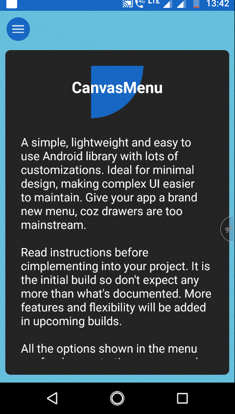

# CanvasMenu

> A minimal replacement of Menus, Navigation drawers and Toolsets.

A simple, lightweight and easy to use Android library with lots of customizations.
Ideal for minimal design, making complex UI easier to maintain.
Give your app a brand new menu, coz drawers are too mainstream.

Read instructions before cimplementing into your project.
It is the initial build so don't expect any more than what's documented.
More features and flexibility will be added in upcoming builds.

All the options/views shown in the menu are for demonstration purpose only and do not have any reletion with the library itself.
CanvasMenu has as may implementations as you can imagine.
Use it as a navigation drawer, toolset or just a menu, choice is yours.



## Installation

Gradle:

Step 1. Add the JitPack repository to your build file

```sh
allprojects {
		repositories {
			...
			maven { url 'https://jitpack.io' }
		}
	}
```

Step 2. Add the dependency

```sh
dependencies {
	        compile 'com.github.ChahatGupta:CanvasMenu:0.1'
	}
```

## Elements

## 1. Quarter (the menu UI) : 

### Usage

Add this to your XML layout file

```sh

<believe.cht.canvasmenu.Quarter
        android:id="@+id/quarter"
        android:layout_width="400dp"
        android:layout_height="400dp">
        android:id="@+id/quarter"
        android:layout_width="400dp"
        android:layout_height="400dp">
        
        <!-- add your views here -->
        
      </believe.cht.canvasmenu.Quarter>
```

### Attribules

```sh

        app:canvasColor="@color/yourColor"
        app:canvasOpeningSpeed="400"
        app:canvasClosingSpeed="400"
        app:closeIcon="@drawable/yourDrawable"

```

### Methods/Functions

```sh

showCanvas()                             //void - opens up the menu
hideCanvas()                             //void - closes the menu
setColor(int color)                      //void - changes canvas color (use only 8 digit color codes)
setCloseIcon(@DrawableRes int closeIcon) //void - changes close icon
setCanvasOpeningSpeed(int openingSpeed)  //void - changes canvas opening speed
setCanvasClosingSpeed(int closingSpeed)  //void - changes canvas closing speed
isOpen()                                 //boolean - returns menu state (open or closed) 


```


## 2. CanvasButton (optional but recommended) :

### Usage

Add this to your XML layout file

```sh

<believe.cht.canvasmenu.CanvasButton
        android:id="@+id/canvas_button"
        android:layout_width="wrap_content"
        android:layout_height="wrap_content" />
        
```

And in Java:

```sh

public class MainActivity extends AppCompatActivity {

    Quarter quarter;
    CanvasButton canvasButton;

    @Override
    protected void onCreate(Bundle savedInstanceState) {
        super.onCreate(savedInstanceState);
        setContentView(R.layout.activity_main);

        quarter = (Quarter) findViewById(R.id.quarter);
        canvasButton = (CanvasButton) findViewById(R.id.canvas_button);
        
        canvasButton.setCanvas(quarter); //mandatory step if using CanvasButton

    }
}

```

### Attributes

```sh
        app:buttonIcon="@drawable/yourDrawable"
        app:buttonColor="@color/yourColor"
```

### Methods/Functions

```sh

setCanvas(final Quarter quarter)         //void - attaches canvas to the button (mandatory)
setColor(int color)                      //void - changes button color (use only 8 digit color codes)
setIcon(@DrawableRes int icon)           //void - changes the button icon

```

Happy compiling!

## Release History

* 0.1
    * CHANGE: Initial build

## Meta

Chahat Gupta – [@i_m_cht](https://twitter.com/i_m_cht) – admin@believe-labs.co

Distributed under the Apache 2.0 license. See ``LICENSE`` for more information.

[https://github.com/ChahatGupta/CanvasMenu](https://github.com/ChahatGupta/)
